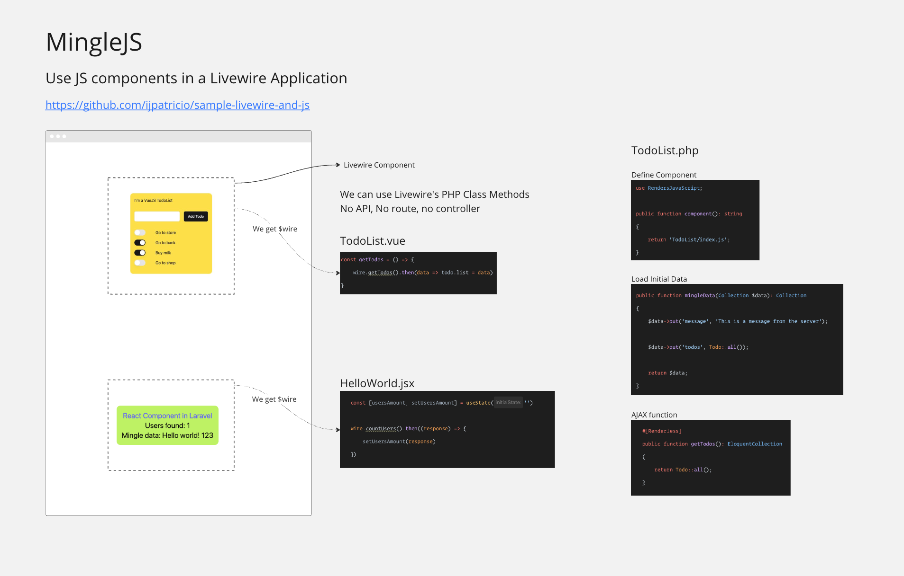

# What is this?

This is a way of using Vue/React components in a Laravel Livewire app.

It's very different from an SPA or Inertia, because we can use Livewire, Alpine, Vue and React, all in the same app.
This is very convenient because say:
- we want to use a couple of Vue components on an individual marketing page
- on another one we want to use React because of a specific component
- also we want to use Livewire on another

Well now you can.

Most likely you will pair Livewire with just one taste of JS framework, but you can mix and match as you wish.

Try it online, by running it in GitPod: [Open in Gitpod](https://gitpod.io/#https://github.com/ijpatricio/minglejs-demo). Login quickly with GitHub, and there's a generaous free tier. It's more than enough to try stuff out.

# Development

Clone the repository, then:
```
cp .env.example .env
composer install
php artisan key:generate
touch database/database.sqlite
php artisan migrate:fresh --seed
php artisan serve
# In another terminal
npm ci
npm run dev
```

# Why?

- Landing pages, marketing pages, etc. => Plenty of React/Vue components.
- JS ecosystem has an infinite amount of tools and libraries.
- We want to use Vue and React, but I don't want to use SPA nor Inertia.
  - I want to use Blade and Livewire, while keeping the possibility to use Vue/React components.
- Being on Blade, SSR for SEO is there right from the beginning.
- You might be thinking you're thinking we should use vanilla JS/jQuery plugins, implementing in Alpine.
  - But I ask: why is that? Some JS frameworks elevate a lot the DX and tooling.
- Having a Livewire component as a container, in our Vue/React component we get to call PHP functions simply by calling `$wire.method()`. We don't have to write an Ajax request, a route, a controller, etc.  

# How?

This is a starter as it stands. 
I got a little paralysed before publishing as package by thinking on implementing in existing projects, since this means to tinker with existing JS files and vite config etc.

Maybe there's a good "compromise/middle ground":
First: having a package we can install at any point.
Then:
- If in a new project, just run `php artisan mingle:install`, because the file states is known, I can update them with confidence.
- If not, follow a guide with "this couple of steps".

Sounds like what I'll do. For the time being you can use this as a starter kit.
